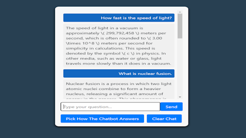

# AI Chatbot
  ## Table of Contents
   - [Demonstration](#Demonstration)
   - [Description](#Description)
   - [LocalSetup](#LocalSetup)
   - [Questions](#Questions)
   - [Screenshot](#Screenshot)
## Demonstration
Live Demo: https://markdrecoll.com/chatbot
## Description
This is an app that lets a user ask questions using ChatGPT's gpt-4o-mini model. This is the more cost effective model which has outdated information and less detailed responses since it is for public use. The user can also change how the chatbot responds using different system parameters. It has a react typescript frontend, node backend, and is styled using react bootstrap.
## LocalSetup
Clone the repo down. Open two terminals one for the server directory, and one for the client directory. Run npm install in both terminals.
Then use npm run dev in both terminals to start the website locally. You can view the website via http://localhost:5173.
## Questions
Email: mark@markdrecoll.com
## Screenshot
